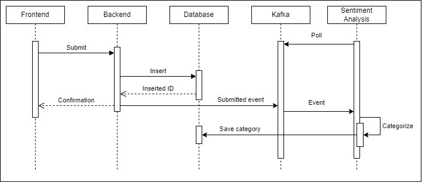

# feed-bok(-bok-bok-bok)

A simple web app

- for submitting feedbacks
- and an admin page for monitoring feedbacks

## Architecture


## Feedback submission sequence diagram



## Setup

- Kafka broker
  ```bash
  docker pull apache/kafka
  docker run -d --name broker -p 127.0.0.1:9092:9092 apache/kafka:latest
  ```
- [Backend](./backend/README.md)
- [Frontend](./frontend/README.md)
- [Sentiment analysis service](./sentiment-analysis/README.md)
